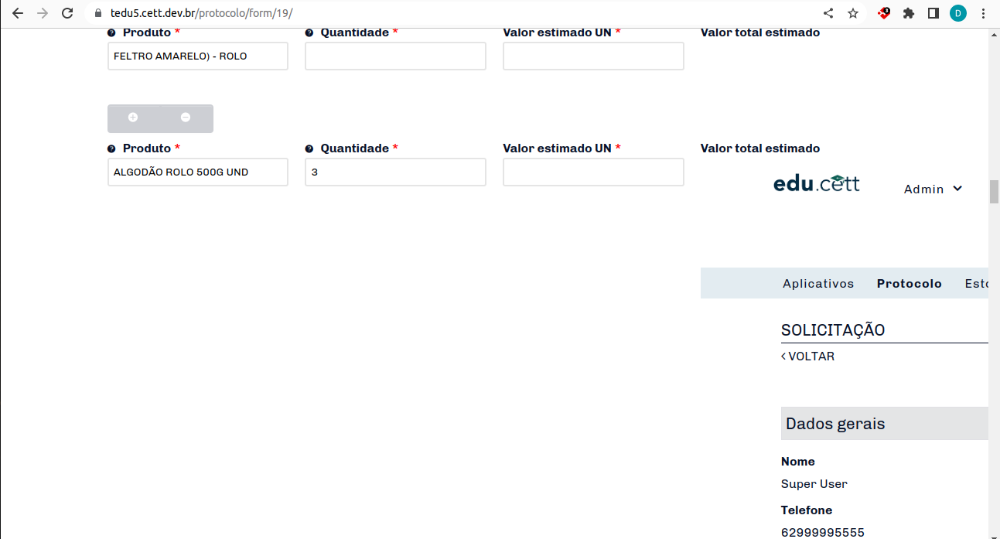

# Elemento Calc

## Branchs

### V1

Esta branch está relacionada com a solução do problema deste plugin em grupos repetíveis. Nesse sentido, o problema ocorria quando se ultrapassava a marca de 30 linhas, a partir desse momento era adicionado no campo uma página inteira de erro. Como mostra abaixo: 

Para a solução do problema citado a cima foram necessárias duas ações.

1. Adicionar na requisição do javascript o endereço da web completo.
Esta alteração foi realizada no arquivo calc.js e comentada com // Resolved repetible groups above 30. Dessa forma, o erro de inserção da página de erro dentro do elemento foi resolvida.

2. Adicionar campo na configuração do plugin para substituição dos placeholders comuns por placeholders que levassem em consideração o número da linha do grupo repetível em questão.
Este campo foi necessário pois cada placeholder utilizado que fizesse parte do grupo repetível era retornado com todos os valores anteriores e não único, dessa forma, foi preciso adicionar ao final do placeholder o número da linha que ele se encontrava. Essa atualização foi realizada em diversos arquivos, porém o principal está no arquivo calc.php comentado entre
//BEGIN - Resolved repetible groups above 30 e //END - Resolved repetible groups above 30 

